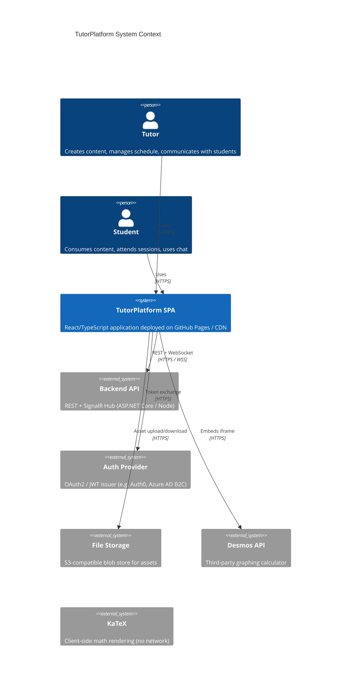
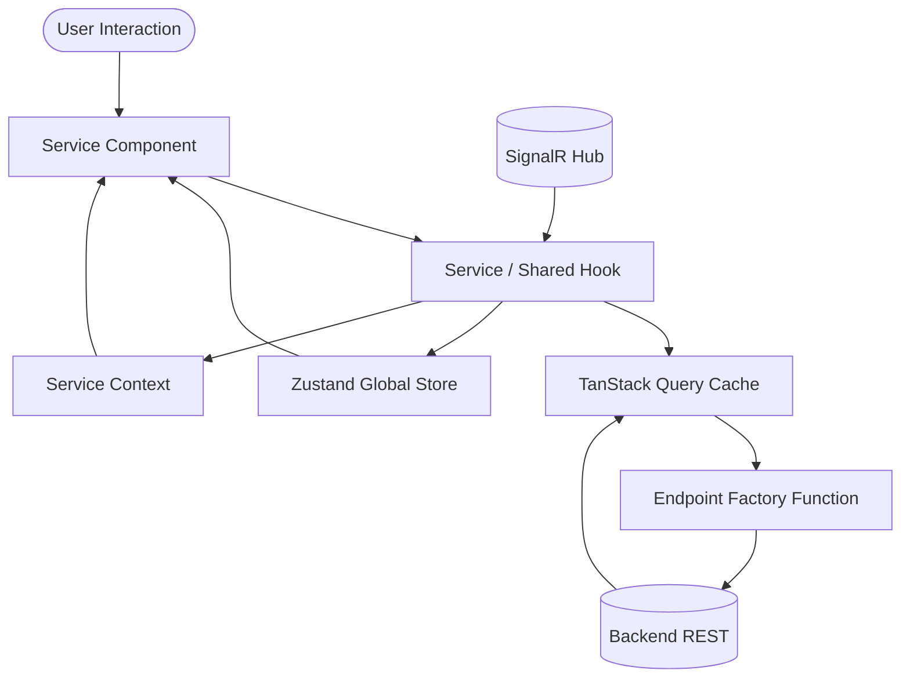
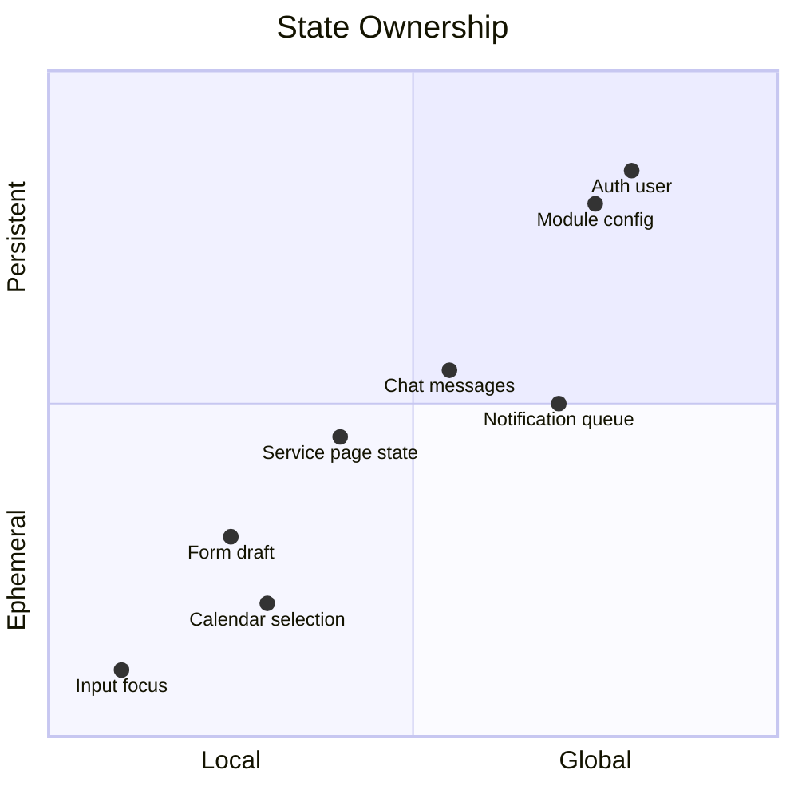
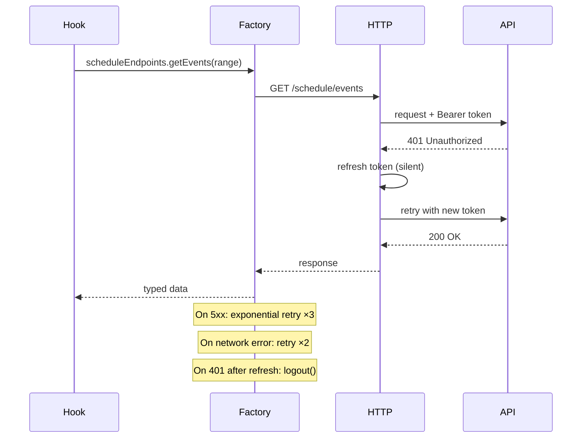
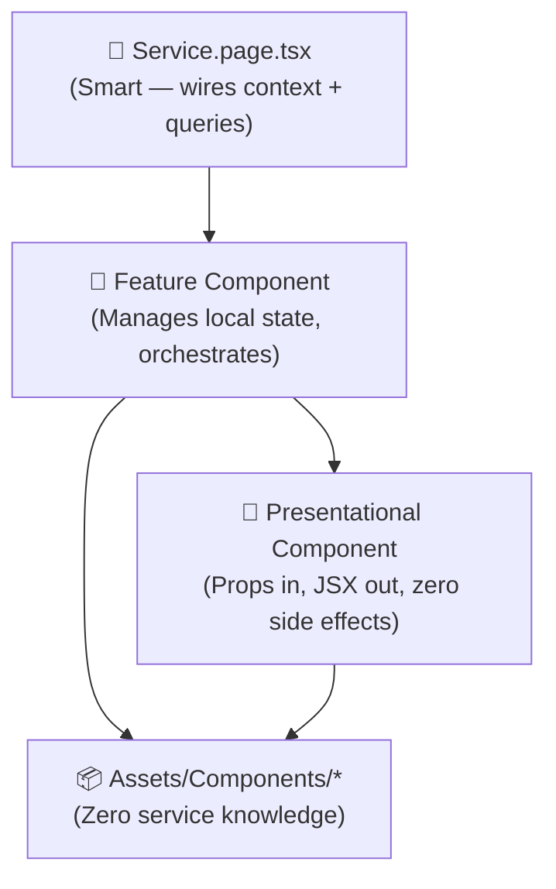
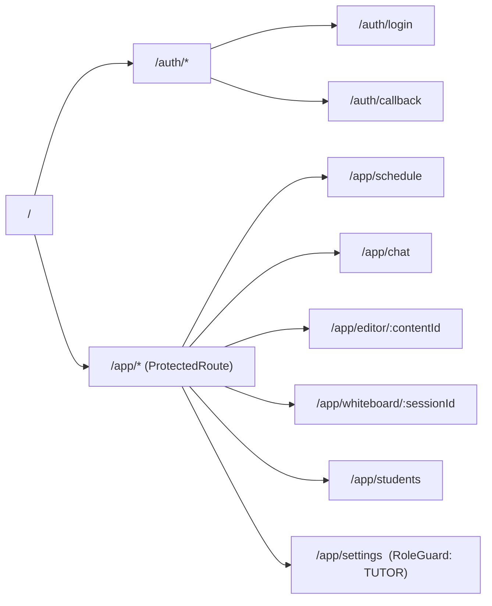

# TutorPlatform — Frontend Architecture

> **Stack at a Glance:** React 18 · TypeScript 5 · Vite 5 · MUI v6 · Zustand · TanStack Query · Zod · Lexical · FullCalendar · KaTeX · Desmos · SignalR · Vitest · Playwright

---

## Table of Contents

1. [High-Level Architecture](#1-high-level-architecture)
2. [Project Folder Structure](#2-project-folder-structure)
3. [State Management Strategy](#3-state-management-strategy)
4. [API Layer Design](#4-api-layer-design)
5. [Component Architecture](#5-component-architecture)
6. [Routing Architecture](#6-routing-architecture)
7. [Performance Considerations](#7-performance-considerations)
8. [Testing Strategy](#8-testing-strategy)
9. [Security Considerations](#9-security-considerations)
10. [Scalability Plan](#10-scalability-plan)
11. [Recommended Tech Stack](#11-recommended-tech-stack)
12. [Example Implementations](#12-example-implementations)

---

## 1. High-Level Architecture

### Architectural Style

The application follows a **Modular Monolith** on the frontend — one deployable unit (Vite SPA) internally divided into self-contained service slices. Each service slice owns its page, local state, components, hooks, and types. Cross-cutting concerns (auth, theme, global notifications, real-time) live in dedicated layers shared by all slices.

This is intentionally **not** micro-frontend architecture. The project is a single tutor SaaS; micro-frontends would add deployment complexity without benefit at this scale. The architecture is designed so it *could* be split later without structural rewrites.

### System Context Diagram



### Core Modules and Responsibilities

| Module | Responsibility |
|--------|---------------|
| **Assets** | Global icons, art, shared components, hooks, and the design token stylesheet |
| **Endpoints** | All API communication — every function exported through a resilience factory (retry, token refresh, error normalisation) |
| **Storage / Context** | Zustand global store (`useGlobalContext`) + per-service React context (`use[Service]Context`) |
| **Services** | Feature slices — one folder per product surface (Scheduling, Chat, Editor, Math, Whiteboard, Settings) |
| **Router** | React Router v6 with lazy loading per service, protected route wrapper, role-based guards |
| **Real-time** | SignalR hub wrapper surfaced as a singleton hook consumed by services that need it |

### Data Flow Overview



**Rules:**
- Components never call `fetch` directly — all network traffic goes through the Endpoint layer.
- TanStack Query owns server-state lifecycle (loading, error, cache, refetch).
- Zustand owns cross-service global state (authenticated user, active module config, notification queue).
- Service context owns page-scoped ephemeral state that doesn't need to survive navigation.

---

## 2. Project Folder Structure

All files must be organized like this
- Assets
  - Art (icons and art used for all services)
  - Components (components reused in different services)
  - Hooks (hooks for calling components. example - notifications)
  - Theme.css (all colors and fonts should be displayed here)
- Endpoints (all backend. every exported function should be output through a factory function which would add retries and retries for expired token etc.)
- Storage
  - Context
    - use[Service]context.ts
  - Global Context like Redux/Zustand stores - useGlobalContext.ts
- Services
  - ServiceName.page.tsx   
  - components
    - /component
      - component.const.ts (all constant variables and classnames should live here)
      - component.styles.ts
      - component.types (all typing for the component should live here)
      - component.tsx
      - component.test.tsx (or a folder if different parts need to be testes)
      - utils.ts (all needed logic)
  - hooks (reused logic for this service only)
    - /hookname
      - hook.ts
      - hook.types.ts
      - /tests

### Organisation Rationale

The structure is **feature-first at the top level, layer-first inside each feature**.

Pure layer-first (`/components`, `/hooks`, `/api` at root) collapses under scale — a developer editing the Scheduling feature has to navigate three separate top-level directories. Pure feature-first without shared layers leads to duplicated `Button` implementations across services.

The hybrid solves both: shared infrastructure lives in `Assets/`, `Endpoints/`, and `Storage/`; feature code is fully co-located inside `Services/ServiceName/`. This mirrors the Screaming Architecture principle — opening `src/Services/` immediately communicates what the product *does*.

---

## 3. State Management Strategy



### Local State (`useState` / `useReducer`)

Use for UI-only state that doesn't need to outlive the component:
- Modal open/close
- Form field focus
- Accordion expanded state
- Tooltip visibility

**Rule:** If two sibling components need it → lift to service context. If two *services* need it → Zustand.

### Server State (TanStack Query)

All data that originates from the backend is owned by TanStack Query. Never copy server responses into Zustand — that creates a synchronisation problem.

```ts
// useCalendarEvents.ts — server state example
export function useCalendarEvents(range: DateRange) {
  return useQuery({
    queryKey: ['calendar', 'events', range],
    queryFn: () => scheduleEndpoints.getEvents(range),
    staleTime: 5 * 60 * 1000,   // 5 min — calendar data changes infrequently
    gcTime: 10 * 60 * 1000,
  });
}
```

### Service-Scoped Context

Per-service React context holds ephemeral page state that multiple components on the same page share but that doesn't need to survive navigation. Prefer this over prop drilling and over Zustand for service-local concerns.

```ts
// Storage/Context/useSchedulingContext.ts
interface SchedulingState {
  selectedEventId: string | null;
  viewMode: 'week' | 'month' | 'agenda';
  setSelectedEvent: (id: string | null) => void;
  setViewMode: (mode: SchedulingState['viewMode']) => void;
}
```

### Global State (Zustand — `useGlobalContext`)

Only three categories live here — the bar for promotion to global is high:

| Slice | Contents |
|-------|----------|
| `auth` | Current user identity, roles, token expiry |
| `config` | Active modules, tutor-tweaked parameters, theme preference |
| `notifications` | Toast queue consumed by the shared `Notification` component |

**Why Zustand over Redux?** Redux Toolkit adds meaningful value for large teams with complex derived state and time-travel debugging needs. For a tutor SaaS with three global slices, Zustand's zero-boilerplate API and built-in devtools are the correct cost/benefit trade-off. Migration to Redux Toolkit later requires only rewriting `useGlobalContext` — no service code changes.

---

## 4. API Layer Design

### Resilience Factory

Every endpoint function is wrapped by the factory before export. No consumer ever calls raw fetch.



### `Endpoints/factory.ts`

```ts
import axios, { AxiosInstance, AxiosRequestConfig } from 'axios';
import axiosRetry from 'axios-retry';
import { refreshToken } from './auth.endpoints';
import { useGlobalContext } from '../Storage/Context/useGlobalContext';

let isRefreshing = false;
let refreshSubscribers: Array<(token: string) => void> = [];

function subscribeToRefresh(cb: (token: string) => void) {
  refreshSubscribers.push(cb);
}
function onRefreshed(token: string) {
  refreshSubscribers.forEach((cb) => cb(token));
  refreshSubscribers = [];
}

export function createApiClient(baseURL: string): AxiosInstance {
  const instance = axios.create({ baseURL, timeout: 15_000 });

  // ── Attach token ──────────────────────────────────────────────────────────
  instance.interceptors.request.use((config) => {
    const token = useGlobalContext.getState().auth.accessToken;
    if (token) config.headers.Authorization = `Bearer ${token}`;
    return config;
  });

  // ── Handle 401 with silent refresh ────────────────────────────────────────
  instance.interceptors.response.use(
    (res) => res,
    async (error) => {
      const originalRequest = error.config;
      if (error.response?.status !== 401 || originalRequest._retry) {
        return Promise.reject(normaliseError(error));
      }
      if (isRefreshing) {
        return new Promise((resolve) => {
          subscribeToRefresh((token) => {
            originalRequest.headers.Authorization = `Bearer ${token}`;
            resolve(instance(originalRequest));
          });
        });
      }
      originalRequest._retry = true;
      isRefreshing = true;
      try {
        const newToken = await refreshToken();
        useGlobalContext.getState().auth.setAccessToken(newToken);
        onRefreshed(newToken);
        originalRequest.headers.Authorization = `Bearer ${newToken}`;
        return instance(originalRequest);
      } catch {
        useGlobalContext.getState().auth.logout();
        return Promise.reject(error);
      } finally {
        isRefreshing = false;
      }
    }
  );

  // ── Retry 5xx + network errors ─────────────────────────────────────────────
  axiosRetry(instance, {
    retries: 3,
    retryDelay: axiosRetry.exponentialDelay,
    retryCondition: (err) =>
      axiosRetry.isNetworkOrIdempotentRequestError(err) ||
      (err.response?.status ?? 0) >= 500,
  });

  return instance;
}

// ── Consistent error shape for consumers ──────────────────────────────────────
export interface AppError {
  message: string;
  code: string;
  status?: number;
}

function normaliseError(error: unknown): AppError {
  if (axios.isAxiosError(error)) {
    return {
      message: error.response?.data?.message ?? error.message,
      code: error.response?.data?.code ?? 'UNKNOWN',
      status: error.response?.status,
    };
  }
  return { message: 'Unexpected error', code: 'UNKNOWN' };
}
```

### Endpoint Module Pattern

```ts
// Endpoints/schedule.endpoints.ts
import { createApiClient } from './factory';
import type { CalendarEvent, CreateSessionDto } from '../Services/Scheduling/components/CalendarView/CalendarView.types';

const client = createApiClient(import.meta.env.VITE_API_BASE_URL);

// ── Every exported function goes through the factory-wrapped client ─────────
export const scheduleEndpoints = {
  getEvents: (range: { start: string; end: string }) =>
    client
      .get<CalendarEvent[]>('/schedule/events', { params: range })
      .then((r) => r.data),

  createSession: (dto: CreateSessionDto) =>
    client.post<CalendarEvent>('/schedule/sessions', dto).then((r) => r.data),

  deleteSession: (id: string) =>
    client.delete(`/schedule/sessions/${id}`).then((r) => r.data),
};
```

### Caching Strategy

| Data type | `staleTime` | `gcTime` | Strategy |
|-----------|------------|---------|---------|
| Auth user | `Infinity` | `Infinity` | Zustand, not TQ |
| Calendar events | 5 min | 10 min | Query with range key |
| Student list | 2 min | 5 min | Background refetch |
| Chat messages | 0 | 30 s | Polling + WS invalidation |
| Module config | 30 min | 1 hr | Prefetch on login |

---

## 5. Component Architecture



### Smart Components (Page-level)

- Live in `Services/ServiceName/ServiceName.page.tsx`
- Subscribe to TanStack Query hooks and service context
- Handle loading/error states via MUI Skeleton and ErrorBoundary
- Never accept props from parents — they are route entry points
- One per route; complex pages compose multiple Feature components

### Feature Components

- Live in `Services/ServiceName/components/ComponentName/`
- Own local UI state (`useState`)
- May call service-specific hooks
- Receive data via props from the page or service context
- Not reused across services (if reuse emerges, promote to `Assets/Components`)

### Shared / Presentational (`Assets/Components`)

- Zero imports from `Services/` or `Endpoints/` — strictly isolated
- Accept all data and callbacks via typed props
- Storybook-compatible: render the same regardless of application state
- Cover: `Button`, `Modal`, `DataTable`, `Badge`, `RichTextViewer`, `Skeleton`, `EmptyState`

### File Co-location Rules

Every component folder is a mini-package:

```
ComponentName/
  component.tsx           ← JSX, event handlers, renders sub-components
  component.styles.ts     ← sx prop objects or styled() — NO inline sx in tsx
  component.types.ts      ← Props interface, local enums, API shape types
  component.const.ts      ← Magic strings, CSS class names, default values
  component.test.tsx      ← Vitest + Testing Library tests
  utils.ts                ← Pure functions used only by this component
  hooks/                  ← Hooks used only by this component or its children
    hookName/
      hook.ts
      hook.types.ts
      tests/
```

**Why `component.styles.ts`?** Keeping MUI `sx` objects in a separate file prevents the JSX from becoming unreadable at scale. The styles file exports plain objects consumed via the `sx` prop — this approach beats `styled-components` for MUI because it participates natively in the MUI theme system.

**Why `component.const.ts`?** CSS class names and string literals scattered across components are a maintenance hazard. A dedicated constants file is the single source of truth and makes rename refactors trivial.

---

## 6. Routing Architecture



### Route Definitions

```ts
// Router/routes.ts
import { lazy } from 'react';

export const routes = {
  scheduling: {
    path: '/app/schedule',
    component: lazy(() => import('../Services/Scheduling/Scheduling.page')),
  },
  chat: {
    path: '/app/chat',
    component: lazy(() => import('../Services/Chat/Chat.page')),
  },
  editor: {
    path: '/app/editor/:contentId',
    component: lazy(() => import('../Services/Editor/Editor.page')),
  },
  whiteboard: {
    path: '/app/whiteboard/:sessionId',
    component: lazy(() => import('../Services/Whiteboard/Whiteboard.page')),
  },
  students: {
    path: '/app/students',
    component: lazy(() => import('../Services/Students/Students.page')),
  },
  settings: {
    path: '/app/settings',
    component: lazy(() => import('../Services/Settings/Settings.page')),
    requiredRole: 'TUTOR' as const,
  },
} satisfies Record<string, RouteDefinition>;
```

### Protected Route

```ts
// Router/ProtectedRoute.tsx
export function ProtectedRoute({ children }: { children: ReactNode }) {
  const { auth } = useGlobalContext();
  const location = useLocation();

  if (!auth.isAuthenticated) {
    return <Navigate to="/auth/login" state={{ from: location }} replace />;
  }
  return <>{children}</>;
}
```

All service routes are wrapped in `<ProtectedRoute>`. The `<RoleGuard>` wraps individual routes that require a specific role (e.g. Settings is tutor-only). Lazy loading is applied to every service page — the Desmos and FullCalendar bundles are heavy and should never appear in the initial load.

---

## 7. Performance Considerations

### Code Splitting

```
Initial bundle (critical path only)
├── React runtime            ~45 KB
├── React Router             ~25 KB
├── MUI core tokens          ~30 KB
└── App shell + auth         ~20 KB
                            ────────
                            ~120 KB gz

Lazy chunks (loaded on demand)
├── Scheduling chunk         FullCalendar + hooks
├── Editor chunk             Lexical + plugins + KaTeX
├── Whiteboard chunk         Canvas API + SignalR
└── Desmos chunk             Desmos embed wrapper
```

Vite's `build.rollupOptions.manualChunks` is used to prevent vendor code from fragmenting unpredictably:

```ts
// vite.config.ts
manualChunks: {
  'vendor-react':    ['react', 'react-dom', 'react-router-dom'],
  'vendor-mui':      ['@mui/material', '@mui/icons-material'],
  'vendor-calendar': ['@fullcalendar/core', '@fullcalendar/react'],
  'vendor-lexical':  ['lexical', '@lexical/react'],
  'vendor-query':    ['@tanstack/react-query'],
}
```

### Memoisation Rules

Only apply when profiling identifies a problem — premature memoisation obscures code and can cause bugs when dependencies are missed.

**Apply `useMemo`:**
- Expensive derived values (e.g. sorting 1000+ calendar events)
- Creating stable object references passed as `queryKey`
- KaTeX/Desmos configuration objects

**Apply `useCallback`:**
- Callbacks passed to memoised child components
- SignalR event handler registrations

**Apply `React.memo`:**
- Long lists rendered with `react-window` (student list, message thread)
- Components that receive stable props but re-render due to parent context updates

**Never apply blindly to:**
- Components that always re-render when parent does (no shared reference issue)
- Simple presentational components with primitive props (React's bailout handles this)

### Rendering Optimisation

- **Virtualisation:** `react-window` for any list longer than ~50 items (message threads, student lists, content library)
- **`startTransition`:** Wrap calendar view-mode switches (week→month) and search filter updates — keeps input responsive while heavy re-renders happen in background
- **Image optimisation:** All tutor-uploaded images served through the CDN with width/format parameters; `` on all below-fold content
- **Web Workers:** KaTeX rendering for large formula documents offloaded via `comlink` to avoid blocking the main thread

---

## 8. Testing Strategy

```mermaid
pyramid
    title Testing Pyramid
    "E2E (Playwright)" : 5
    "Integration (Vitest + MSW)" : 25
    "Unit (Vitest + Testing Library)" : 70
```

### Unit Tests (`*.test.tsx` alongside component)

Scope: single component or hook in isolation. Mock all hooks and endpoints.

```ts
// CalendarView.test.tsx
import { render, screen } from '@testing-library/react';
import { CalendarView } from './CalendarView';

it('renders empty state when no events provided', () => {
  render(<CalendarView events={[]} onEventClick={vi.fn()} />);
  expect(screen.getByText(/no sessions scheduled/i)).toBeInTheDocument();
});
```

### Integration Tests (`hook.test.ts` in `tests/` folder)

Scope: hook + real endpoint function + MSW mock server. Validates the full data-fetch cycle without a real backend.

```ts
// useCalendarEvents/tests/useCalendarEvents.test.ts
import { renderHook, waitFor } from '@testing-library/react';
import { server } from '../../../test-utils/msw-server';
import { http, HttpResponse } from 'msw';
import { useCalendarEvents } from '../useCalendarEvents';

it('returns transformed events from API', async () => {
  server.use(
    http.get('/schedule/events', () =>
      HttpResponse.json([{ id: '1', title: 'Algebra I', start: '2025-09-01T10:00:00Z' }])
    )
  );
  const { result } = renderHook(() =>
    useCalendarEvents({ start: '2025-09-01', end: '2025-09-07' })
  );
  await waitFor(() => expect(result.current.isSuccess).toBe(true));
  expect(result.current.data![0].title).toBe('Algebra I');
});
```

### E2E Tests (Playwright)

Scope: critical user journeys only — not exhaustive UI coverage. Focus on paths where a regression would block real users.

Priority paths:
1. Login → view schedule → book session
2. Open editor → insert math formula → save
3. Start whiteboard session → draw → real-time sync (two browser contexts)
4. Tutor enables/disables module in Settings → module disappears from nav

```ts
// e2e/scheduling.spec.ts
test('tutor can book a new session', async ({ page }) => {
  await page.goto('/app/schedule');
  await page.getByRole('button', { name: /new session/i }).click();
  await page.getByLabel('Title').fill('Calculus Review');
  await page.getByRole('button', { name: /confirm/i }).click();
  await expect(page.getByText('Calculus Review')).toBeVisible();
});
```

### Tools Summary

| Need | Tool |
|------|------|
| Test runner | Vitest |
| Component tests | `@testing-library/react` |
| API mocking | MSW 2 |
| E2E | Playwright |
| Coverage | `@vitest/coverage-v8` |
| Accessibility | `jest-axe` via Vitest |

---

## 9. Security Considerations

### Authentication

- Tokens stored in **memory only** (Zustand in-memory store). Never `localStorage`, never `sessionStorage`.
- Refresh token stored in an `HttpOnly`, `Secure`, `SameSite=Strict` cookie set by the backend — the SPA never reads it.
- Silent refresh performed by the Endpoint factory (Section 4) before expiry using a scheduled interval.
- On tab close and re-open: the SPA detects an expired in-memory access token, makes one silent refresh attempt via the HttpOnly cookie, then falls back to the login page.

### XSS Prevention

- **Never use `dangerouslySetInnerHTML`** — all HTML from the backend is rendered through the read-only Lexical `RichTextViewer` which sanitises the Lexical JSON format, not raw HTML.
- MUI components render via React's virtual DOM — no raw HTML injection surface.
- All user-generated formula content goes through KaTeX's own sanitiser before render.
- Content Security Policy (CSP) header set by the CDN/server:
  ```
  Content-Security-Policy:
    default-src 'self';
    script-src 'self' https://www.desmos.com;
    frame-src https://www.desmos.com;
    img-src 'self' data: https://<cdn-domain>;
    connect-src 'self' https://<api-domain> wss://<api-domain>;
  ```

### Authorization

- Role is stored in the JWT claim and validated on every API call by the backend.
- The `<RoleGuard>` component hides UI elements from unauthorised roles but **never relies on this as a security boundary** — the backend enforces all role checks.
- Module feature flags (enabled/disabled by tutor) are validated server-side; the frontend merely reflects the config.

### Secure Storage Practices

| Data | Storage | Reason |
|------|---------|--------|
| Access token | Zustand memory | XSS-resistant; lost on tab close (by design) |
| Refresh token | HttpOnly cookie | JS cannot read; safe from XSS |
| User preferences | `localStorage` (non-sensitive) | Survives reload; no PII |
| Draft editor content | `IndexedDB` via Lexical | Structured data; large size; no tokens |
| SignalR connection ID | Memory | Ephemeral per session |

---

## 10. Scalability Plan

### Small Project (1–3 developers, MVP)

- Use all layers described above even at small scale — the cost is low, the structural debt avoided is high.
- Skip Storybook initially; add when the shared component library grows past ~10 components.
- Single deployment target (GitHub Pages via Vite build).
- Vitest unit tests only; add Playwright when the first critical user journey is stable.

### Medium Project (4–8 developers, feature-complete)

- Add **Storybook** for `Assets/Components/*` — enables designers to review components in isolation.
- Add **Module Federation** boundary awareness: each `Services/` slice should already be independently extractable with no cross-service imports (enforce via ESLint `import/no-restricted-paths`).
- Introduce **MSW** for full local development mocking — eliminates dependency on a running backend during feature work.
- Add **Chromatic** for visual regression testing on shared components.
- Consider a **monorepo** (Turborepo) if separate teams own separate services.

### Large / Enterprise Project (8+ developers, multi-tenant)

- Extract `Assets/Components` into a **private npm package** (design system) consumed by multiple apps.
- Introduce **Module Federation** (Vite plugin) to allow independent deployment of heavy services (Whiteboard, Editor) if they need different release cadences.
- Replace GitHub Pages with a proper CDN + CI/CD pipeline (GitHub Actions → S3 + CloudFront).
- Add **OpenTelemetry** instrumentation for frontend performance monitoring.
- Enforce **architectural fitness functions** in CI: bundle size budgets, import boundary checks, accessibility score thresholds.
- Add a **BFF (Backend for Frontend)** layer if the REST API grows too complex for direct SPA consumption.

---

## 11. Recommended Tech Stack

| Category | Choice | Rationale |
|----------|--------|-----------|
| Framework | React 18 + TypeScript 5 | Concurrent features, strict typing |
| Build | Vite 5 | Sub-second HMR, native ESM, excellent code-split control |
| UI | MUI v6 | Comprehensive, accessible, works with Emotion theme system |
| Global state | Zustand 5 | Minimal boilerplate, devtools, no Context re-render issues |
| Server state | TanStack Query v5 | Best-in-class cache, background refetch, optimistic updates |
| Forms | React Hook Form | Uncontrolled, performant, Zod integration |
| Validation | Zod | Runtime + compile-time type safety; schemas reused as TypeScript types |
| HTTP | Axios + axios-retry | Interceptors, retry, timeout; no `fetch` wrapper reimplementation needed |
| Rich text | Lexical | Meta-maintained, extensible plugin model, accessible |
| Calendar | FullCalendar | Most feature-complete, React wrapper, WCAG AA compliant |
| Math | KaTeX | Faster than MathJax, client-side, no CDN dependency needed |
| Graphing | Desmos API | Best-in-class interactive graphing; iframe embed is safe and sandboxed |
| Real-time | `@microsoft/signalr` | Reliable WS + SSE + long-poll fallback |
| Unit tests | Vitest + Testing Library | Same config as Vite, fast, RTL for user-centric assertions |
| API mocking | MSW 2 | Intercepts at network level; same mocks in tests and dev |
| E2E | Playwright | Multi-browser, built-in tracing, first-class TypeScript |
| Lint | ESLint + `eslint-plugin-import` | Enforce architectural boundaries |
| Format | Prettier | Non-negotiable consistency |

---

## 12. Example Implementations

### 12.1 Feature Folder — `Services/Scheduling/`

```ts
// Services/Scheduling/components/CalendarView/CalendarView.types.ts
export interface CalendarEvent {
  id: string;
  title: string;
  start: string;   // ISO 8601
  end: string;
  studentId: string;
  status: 'confirmed' | 'pending' | 'cancelled';
}

export interface CalendarViewProps {
  events: CalendarEvent[];
  isLoading: boolean;
  onEventClick: (event: CalendarEvent) => void;
  onDateSelect: (start: Date, end: Date) => void;
}
```

```ts
// Services/Scheduling/components/CalendarView/CalendarView.const.ts
export const CALENDAR_DEFAULTS = {
  initialView: 'timeGridWeek',
  slotMinTime: '07:00:00',
  slotMaxTime: '22:00:00',
  allDaySlot: false,
} as const;

export const CSS = {
  root: 'calendar-view-root',
  eventConfirmed: 'calendar-event--confirmed',
  eventPending: 'calendar-event--pending',
} as const;
```

```ts
// Services/Scheduling/components/CalendarView/CalendarView.styles.ts
import type { SxProps, Theme } from '@mui/material';

export const styles = {
  root: {
    height: '100%',
    '& .fc-toolbar-title': {
      fontSize: 'var(--font-size-lg)',
      fontWeight: 600,
    },
  } satisfies SxProps<Theme>,

  loadingOverlay: {
    position: 'absolute',
    inset: 0,
    display: 'flex',
    alignItems: 'center',
    justifyContent: 'center',
    bgcolor: 'rgba(255,255,255,0.7)',
  } satisfies SxProps<Theme>,
};
```

```tsx
// Services/Scheduling/components/CalendarView/CalendarView.tsx
import FullCalendar from '@fullcalendar/react';
import timeGridPlugin from '@fullcalendar/timegrid';
import interactionPlugin from '@fullcalendar/interaction';
import { Box, CircularProgress } from '@mui/material';
import { CALENDAR_DEFAULTS } from './CalendarView.const';
import { styles } from './CalendarView.styles';
import type { CalendarViewProps } from './CalendarView.types';
import { toFullCalendarEvents } from './utils';

export function CalendarView({
  events,
  isLoading,
  onEventClick,
  onDateSelect,
}: CalendarViewProps) {
  return (
    <Box sx={styles.root} position="relative">
      {isLoading && (
        <Box sx={styles.loadingOverlay}>
          <CircularProgress />
        </Box>
      )}
      <FullCalendar
        plugins={[timeGridPlugin, interactionPlugin]}
        {...CALENDAR_DEFAULTS}
        events={toFullCalendarEvents(events)}
        eventClick={(info) => {
          const match = events.find((e) => e.id === info.event.id);
          if (match) onEventClick(match);
        }}
        select={(info) => onDateSelect(info.start, info.end)}
        selectable
        height="100%"
      />
    </Box>
  );
}
```

```ts
// Services/Scheduling/components/CalendarView/utils.ts
import type { CalendarEvent } from './CalendarView.types';
import { CSS } from './CalendarView.const';

export function toFullCalendarEvents(events: CalendarEvent[]) {
  return events.map((e) => ({
    id: e.id,
    title: e.title,
    start: e.start,
    end: e.end,
    classNames: [
      e.status === 'confirmed' ? CSS.eventConfirmed : CSS.eventPending,
    ],
  }));
}
```

---

### 12.2 Endpoint Module

```ts
// Endpoints/chat.endpoints.ts
import { createApiClient } from './factory';
import type { Message, SendMessageDto, Thread } from '../Services/Chat/components/MessageThread/MessageThread.types';

const client = createApiClient(import.meta.env.VITE_API_BASE_URL);

export const chatEndpoints = {
  getThreads: (): Promise<Thread[]> =>
    client.get<Thread[]>('/chat/threads').then((r) => r.data),

  getMessages: (threadId: string): Promise<Message[]> =>
    client.get<Message[]>(`/chat/threads/${threadId}/messages`).then((r) => r.data),

  sendMessage: (dto: SendMessageDto): Promise<Message> =>
    client.post<Message>(`/chat/threads/${dto.threadId}/messages`, dto).then((r) => r.data),

  markRead: (threadId: string): Promise<void> =>
    client.patch(`/chat/threads/${threadId}/read`).then(() => void 0),
};
```

---

### 12.3 Custom Hook

```ts
// Services/Chat/hooks/useChatMessages/useChatMessages.types.ts
export interface UseChatMessagesOptions {
  threadId: string;
  enabled?: boolean;
}

export interface UseChatMessagesReturn {
  messages: Message[];
  isLoading: boolean;
  sendMessage: (text: string) => Promise<void>;
  isSending: boolean;
}
```

```ts
// Services/Chat/hooks/useChatMessages/useChatMessages.ts
import { useQuery, useMutation, useQueryClient } from '@tanstack/react-query';
import { chatEndpoints } from '../../../../Endpoints';
import { useSignalR } from '../../../../Assets/Hooks/useSignalR/useSignalR';
import { useEffect } from 'react';
import type { UseChatMessagesOptions, UseChatMessagesReturn } from './useChatMessages.types';
import type { Message } from '../../components/MessageThread/MessageThread.types';

const QUERY_KEY = (threadId: string) => ['chat', 'messages', threadId] as const;

export function useChatMessages({
  threadId,
  enabled = true,
}: UseChatMessagesOptions): UseChatMessagesReturn {
  const queryClient = useQueryClient();
  const { on, off } = useSignalR();

  // ── Server state ───────────────────────────────────────────────────────────
  const { data: messages = [], isLoading } = useQuery({
    queryKey: QUERY_KEY(threadId),
    queryFn: () => chatEndpoints.getMessages(threadId),
    enabled: enabled && Boolean(threadId),
    staleTime: 0,  // chat messages are always fresh
  });

  // ── Real-time updates ──────────────────────────────────────────────────────
  useEffect(() => {
    const handler = (incoming: Message) => {
      if (incoming.threadId !== threadId) return;
      queryClient.setQueryData<Message[]>(
        QUERY_KEY(threadId),
        (prev = []) => [...prev, incoming]
      );
    };
    on('ReceiveMessage', handler);
    return () => off('ReceiveMessage', handler);
  }, [threadId, queryClient, on, off]);

  // ── Mutation ───────────────────────────────────────────────────────────────
  const { mutateAsync: sendMessage, isPending: isSending } = useMutation({
    mutationFn: (text: string) =>
      chatEndpoints.sendMessage({ threadId, text }),
    onSuccess: (newMessage) => {
      queryClient.setQueryData<Message[]>(
        QUERY_KEY(threadId),
        (prev = []) => [...prev, newMessage]
      );
    },
  });

  return {
    messages,
    isLoading,
    sendMessage: (text) => sendMessage(text).then(() => void 0),
    isSending,
  };
}
```

---

### 12.4 Shared Component

```tsx
// Assets/Components/Modal/Modal.tsx
import {
  Dialog,
  DialogTitle,
  DialogContent,
  DialogActions,
  IconButton,
  Typography,
} from '@mui/material';
import CloseIcon from '@mui/icons-material/Close';
import { styles } from './Modal.styles';
import type { ModalProps } from './Modal.types';

export function Modal({
  open,
  onClose,
  title,
  children,
  actions,
  maxWidth = 'sm',
  'aria-labelledby': labelId = 'modal-title',
}: ModalProps) {
  return (
    <Dialog
      open={open}
      onClose={onClose}
      maxWidth={maxWidth}
      fullWidth
      aria-labelledby={labelId}
    >
      <DialogTitle sx={styles.title} id={labelId}>
        <Typography variant="h6" component="span">
          {title}
        </Typography>
        <IconButton
          aria-label="close modal"
          onClick={onClose}
          sx={styles.closeButton}
          size="small"
        >
          <CloseIcon fontSize="small" />
        </IconButton>
      </DialogTitle>

      <DialogContent dividers>{children}</DialogContent>

      {actions && <DialogActions sx={styles.actions}>{actions}</DialogActions>}
    </Dialog>
  );
}
```

```ts
// Assets/Components/Modal/Modal.types.ts
import type { DialogProps } from '@mui/material';
import type { ReactNode } from 'react';

export interface ModalProps {
  open: boolean;
  onClose: () => void;
  title: string;
  children: ReactNode;
  actions?: ReactNode;
  maxWidth?: DialogProps['maxWidth'];
  'aria-labelledby'?: string;
}
```

---

### 12.5 Global Context (Zustand)

```ts
// Storage/Context/useGlobalContext.ts
import { create } from 'zustand';
import { devtools } from 'zustand/middleware';
import type { GlobalStore } from './useGlobalContext.types';

export const useGlobalContext = create<GlobalStore>()(
  devtools(
    (set) => ({
      // ── Auth slice ─────────────────────────────────────────────────────────
      auth: {
        user: null,
        accessToken: null,
        isAuthenticated: false,
        setAccessToken: (token) =>
          set((s) => ({ auth: { ...s.auth, accessToken: token, isAuthenticated: true } })),
        setUser: (user) =>
          set((s) => ({ auth: { ...s.auth, user } })),
        logout: () =>
          set((s) => ({ auth: { ...s.auth, user: null, accessToken: null, isAuthenticated: false } })),
      },

      // ── Config slice (tutor's module toggles) ──────────────────────────────
      config: {
        enabledModules: ['scheduling', 'chat', 'editor'],
        parameters: {},
        setEnabledModules: (modules) =>
          set((s) => ({ config: { ...s.config, enabledModules: modules } })),
      },

      // ── Notification queue ─────────────────────────────────────────────────
      notifications: {
        queue: [],
        push: (notification) =>
          set((s) => ({
            notifications: {
              ...s.notifications,
              queue: [...s.notifications.queue, { ...notification, id: crypto.randomUUID() }],
            },
          })),
        dismiss: (id) =>
          set((s) => ({
            notifications: {
              ...s.notifications,
              queue: s.notifications.queue.filter((n) => n.id !== id),
            },
          })),
      },
    }),
    { name: 'TutorPlatform' }
  )
);
```

---

## Appendix: Design Decisions Summary

| Decision | Alternative Considered | Why This Choice |
|----------|----------------------|-----------------|
| Zustand for global state | Redux Toolkit | RTK is excellent but overkill for 3 global slices; Zustand produces less boilerplate with equivalent devtools support |
| TanStack Query for server state | SWR | TQ has superior mutation support, optimistic updates, and `select` transforms |
| Axios over native fetch | `ky`, `wretch` | Interceptor model maps directly to the token-refresh pattern; best-documented for retry |
| Vite over CRA/Next.js | Next.js | No SSR requirement (deployed to GitHub Pages); Vite's HMR speed and build control are superior for a pure SPA |
| Feature-first folders | Layer-first | Reduces cognitive load when working in a single service; modules are independently moveable |
| Lexical over ProseMirror | TipTap (ProseMirror) | Meta-maintained, TypeScript-first, better plugin isolation; TipTap's schema is harder to extend for custom math nodes |
| Co-located `*.styles.ts` | CSS Modules | MUI's `sx` system integrates with the theme; CSS Modules require separate theme variable bridges |
| MSW for API mocking | json-server | MSW intercepts at the service worker level — the same mock handlers run in tests and the browser dev environment |

---

*Last updated: architecture v1.0 — reflects React 18, MUI v6, TanStack Query v5, Zustand v5, Vite 5.*
